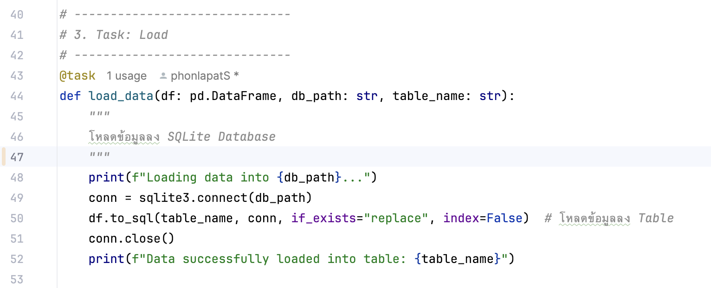

# Data Pipeline with Prefect using Python and Sqlite3 based on ETL Process

ETL Process concept : 

  

  

  

## Library that use in this project

### Working step:
1. Extract
   
2. Transform
   
3. Load
   

---

## See task and flow status in Prefect Dashboard
type 'prefect start server' to check out the dashboard at http://127.0.0.1:4200

## Dashboard

### 1. ดูสถานะ Flow

### 2. การทำงานของ Task

---

### ตรวจสอบใน Sqlite3
เข้า DB ผ่าน Terminal

### ตรวจสอบโครงสร้างของตาราง
.schema redwine_data

### ดูข้อมูลในตาราง
SELECT * FROM redwine_data

### ปรับให้มีหัวตารางและแสดงออกมาเป็น column ด้วย 2 คำสั่งนี้

.headers on

.mode column

SELECT * FROM redwine_data อีกครั้ง

  

